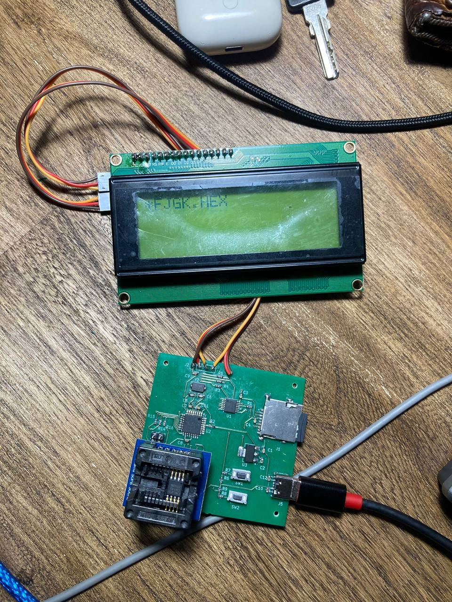

This project is based on Nick Gammon's ATmega_Hex_Uploader.
I added the LCD2004 to the project and design PCB so this device look more decent.
The main reason of this project is to make a small device to program a lot of MCUs like Attiny45
with simple and easy interface and without a computer. 
